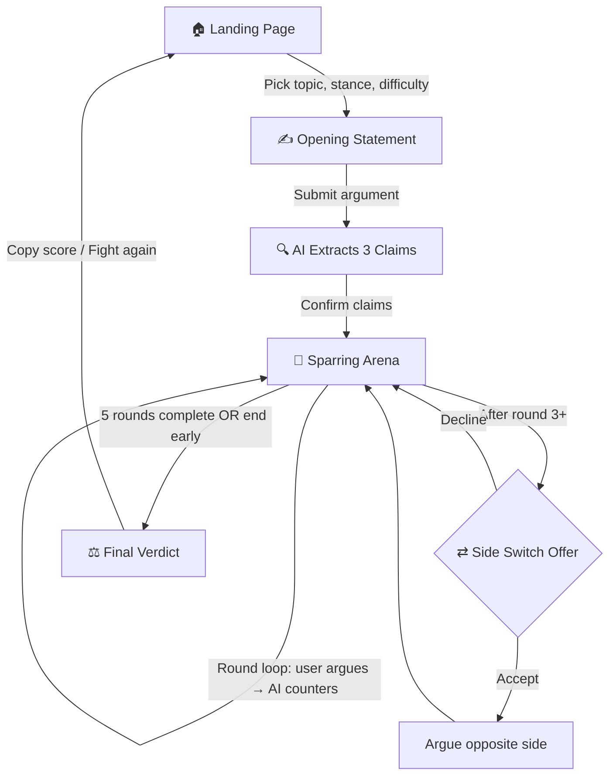

# 🥊 Argument Gym — Workflow Analysis & Gamification Ideas

## Current Workflow (How It Works Today)



### Phase-by-Phase Breakdown

| Phase | Component | What Happens |
|---|---|---|
| **Landing** | `Landing.jsx` | User picks a topic (custom or from 8 presets), stance (for/against/undecided), and difficulty (casual/rigorous/brutal) |
| **Statement** | `Statement.jsx` | User writes an opening argument (min 20 chars), word count shown live |
| **Extraction** | `Loader.jsx` | AI parses the statement into exactly 3 core claims via `/api/extract-claims` |
| **Claims Confirm** | `ClaimsConfirm.jsx` | User reviews the 3 extracted claims + summary, then enters the arena |
| **Sparring** | `Sparring.jsx` | Split-panel layout: sidebar (topic, scores, claims) + arena (round-by-round chat). AI scores each round on Logic/Evidence/Originality (0-10), shown as running averages (0-100 scale) |
| **Side Switch** | `SideSwitchOffer.jsx` | After round 3+, user can flip to argue the opposite side. Unlocks the **Perspective** score axis |
| **Verdict** | `Verdict.jsx` | Final scores (Logic, Evidence, Originality, Perspective, Clarity) as SVG rings. Claim survival status (✓/✗). Strengths/Weaknesses. Won/Lost/Draw verdict. Copy-to-clipboard sharecard |

### State Machine (useGym.js)

The entire flow is managed by a single custom hook with 9 phases, no routing — just a `switch` statement in `App.jsx`. State resets fully on "Fight Again."

### What's **Missing** (No persistence at all)
- ❌ No user accounts / auth
- ❌ No debate history — everything lost on refresh
- ❌ No progress tracking across sessions
- ❌ No social features
- ❌ No rewards, streaks, or progression

---

## 🎮 Gamification Ideas

### Tier 1 — Quick Wins (Frontend-only, no backend changes)

These can be built purely in the browser using `localStorage`.

---

#### 1. 🏅 XP & Leveling System

Award XP after every verdict based on performance:

```
XP = (logic + evidence + originality + clarity) / 4  ×  difficultyMultiplier
```

| Difficulty | Multiplier |
|---|---|
| Casual | ×1.0 |
| Rigorous | ×1.5 |
| Brutal | ×2.5 |

**Levels** with boxing-themed ranks:

| Level | Title | XP Required |
|---|---|---|
| 1 | 🥊 Rookie | 0 |
| 2 | 🥊 Scrapper | 100 |
| 3 | 🥊 Contender | 300 |
| 4 | 🥊 Brawler | 600 |
| 5 | 🥊 Tactician | 1000 |
| 6 | 🥊 Strategist | 1500 |
| 7 | 🥊 Veteran | 2200 |
| 8 | 🥊 Master Debater | 3000 |
| 9 | 🥊 Champion | 4000 |
| 10 | 🥊 Legend | 5500 |

Show an **XP progress bar** on the Landing page and a **level badge** throughout the app.

---

#### 2. 🔥 Win Streak & Daily Streak

- **Win Streak**: Consecutive debates won. Show a flame counter: `🔥3` → `🔥🔥7` → `🔥🔥🔥15`
- **Daily Streak**: One debate per day keeps the streak alive. Calendar-style heatmap (like GitHub contributions)
- **Streak Bonuses**: +10% XP per consecutive win, capped at +50%

---

#### 3. 🏆 Achievement / Badge System

Unlock badges for milestones. Examples:

| Badge | Condition | Rarity |
|---|---|---|
| 🎯 **First Blood** | Complete your first debate | Common |
| 🧠 **Logic Lord** | Score 90+ Logic in a verdict | Rare |
| 📚 **Evidence Machine** | Score 90+ Evidence in a verdict | Rare |
| 💡 **Original Thinker** | Score 90+ Originality in a verdict | Rare |
| ⇄ **Devil's Advocate** | Complete a side-switch debate | Uncommon |
| 🔥 **On Fire** | Win 5 debates in a row | Epic |
| 💀 **Brutal Survivor** | Win a debate on Brutal difficulty | Epic |
| 🎖️ **Undefeated** | Win 10 debates without a loss | Legendary |
| 🏋️ **Gym Rat** | Complete 50 total debates | Epic |
| 🌊 **Deep Thinker** | Use all 5 rounds in a single debate | Uncommon |
| ✍️ **Wordsmith** | Write 500+ words total in a single debate | Uncommon |
| 🎯 **Claim Defender** | Have all 3 claims survive in the verdict | Rare |
| 🗺️ **Explorer** | Debate 8 different topics | Uncommon |
| 📅 **7-Day Streak** | Maintain a daily streak for 7 days | Rare |

Show a **trophy case** on the landing page. New badge unlocks get a celebratory animation overlay.

---

#### 4. 📊 Debate History & Stats Dashboard

Persist debate results in `localStorage`:

- **History list**: Topic, date, verdict, scores — with ability to review any past debate
- **Stats overview**:
  - Total debates, Win/Loss/Draw ratio (pie chart)
  - Average scores by category (radar chart)
  - Favorite topics (bar chart)
  - Difficulty distribution
  - Best/worst performances
- **Personal bests**: "Your highest Logic score was 94 on *AI will replace most human jobs*"

---

#### 5. ⏱️ Round Timer & Time Pressure Mode

- Optional **countdown timer per round** (e.g., 2 min for casual, 90 sec for rigorous, 60 sec for brutal)
- If time runs out, the round auto-submits with whatever's typed
- Bonus XP for "speed rounds" (submit under 30 seconds with a score above 7)
- Adds the intensity of a real debate under pressure

---

### Tier 2 — Medium Effort (Minor backend additions)

---

#### 6. 🧩 Fallacy Detector

Enhance the AI prompt to explicitly tag fallacies detected in the user's arguments:

- Show fallacy cards mid-debate: `⚠️ Ad Hominem detected in Round 2`
- Track a **"Fallacy Count"** — lower is better
- Achievement: **"Clean Fighter"** — complete a brutal debate with 0 fallacies detected
- Could display a small "Fallacy Encyclopedia" that grows as users encounter new fallacies

---

#### 7. 📂 Topic Categories & Topic of the Day

Organize topics into categories:

| Category | Examples |
|---|---|
| 🤖 Technology | AI jobs, social media, smartphones |
| 💰 Economics | UBI, capitalism, crypto |
| 🌍 Society | Remote work, education, healthcare |
| 🔬 Science | Nuclear energy, space, climate |
| 🎭 Philosophy | Free will, morality, consciousness |

- **Topic of the Day**: Rotate a featured topic daily. Bonus XP for debating the daily topic.
- **Category Mastery**: Track wins per category. Show progress rings per category.

---

#### 8. 🎯 Challenge Mode / Daily Challenges

Specific objectives that rotate daily or weekly:

- *"Win a debate using under 50 words per round"*
- *"Score 8+ on all three axes in a single round"*
- *"Win on Brutal without side-switching"*
- *"Argue AGAINST something you believe in"*

Completing challenges gives bonus XP + exclusive challenge badges.

---

#### 9. 💬 AI Personality Variants

Let users pick an **opponent style** beyond just difficulty:

| Opponent | Style |
|---|---|
| 🎓 **The Professor** | Academic, cites studies, demands sources |
| 🐍 **The Devil's Advocate** | Slippery, twists your words, Socratic |
| ⚖️ **The Lawyer** | Procedural, demands precision, finds loopholes |
| 🔥 **The Street Fighter** | Aggressive, uses analogies, emotional appeals |
| 🧊 **The Stoic** | Cold logic only, no emotion, purely analytical |

Each personality modifies the system prompt. Unlockable at higher levels.

---

### Tier 3 — Advanced Features (Backend + persistence required)

---

#### 10. 🏟️ Leaderboard

- **Global leaderboard** ranked by XP, win rate, or highest single-debate score
- **Weekly leaderboard** for competitive bursts
- Filter by difficulty tier
- Show top 3 with podium animation

Requires: User accounts + a database (even just a simple JSON file or SQLite)

---

#### 11. ⚔️ Multiplayer: Human vs Human

Instead of AI, match two users who take opposite sides:

- **Async mode**: Take turns over hours/days (like chess by mail)
- **Live mode**: Real-time debate with a timer
- AI acts as **judge only** — scores both sides after all rounds
- Show a split-screen verdict comparing both debaters

Requires: WebSocket or polling, user accounts, matchmaking

---

#### 12. 🎓 Training Mode / Argument Academy

Guided tutorials that teach argumentation skills:

- **Lesson modules**: "How to structure a claim," "Identifying fallacies," "Using evidence effectively"
- Each lesson ends with a practice debate that targets the skill
- Progressive difficulty curve
- Unlock new lessons as you level up

---

#### 13. 📈 Skill Tree / Argument Radar

A visual **skill progression radar** that grows over time:

```
         Logic
          /|\
         / | \
        /  |  \
Evidence---+---Originality
        \  |  /
         \ | /
          \|/
       Perspective
```

- Each axis grows based on your cumulative scores
- Unbalanced? The app suggests: *"Your Evidence is lagging — try a Science topic with citations"*
- Milestone rewards when an axis hits 50, 75, 90

---

#### 14. 🗳️ Community Debate Topics

Let users submit and vote on debate topics:

- Upvote/downvote topics
- "Trending" section on landing page
- See how many people argued FOR vs AGAINST each topic (global stance distribution)

---

#### 15. 🎬 Debate Replay & Sharing

- Generate a shareable **debate replay page** (unique URL)
- Animated playback of the debate round-by-round
- Social media share cards with verdict + scores (Open Graph image)
- "Watch how I destroyed the AI on Brutal" type sharing

---

## 🚀 Recommended Implementation Order

> [!IMPORTANT]
> Start with Tier 1 items — they require **zero backend changes** and immediately make the app feel 10× more engaging.

### Phase 1: Core Gamification Loop (Frontend-only)
1. **Debate History** (localStorage) — gives persistence, makes everything else meaningful
2. **XP & Levels** — the backbone of progression
3. **Achievement Badges** — dopamine hits, reasons to replay
4. **Win/Daily Streaks** — retention mechanism

### Phase 2: Depth & Variety
5. **Stats Dashboard** — visualize progress
6. **Topic Categories + Topic of the Day** — variety and daily engagement
7. **Round Timer** — adds intensity
8. **Challenge Mode** — replayability

### Phase 3: Social & Advanced
9. **AI Personalities** — content expansion
10. **Fallacy Detector** — educational value
11. **Leaderboard** — competition
12. **Debate Replay & Sharing** — virality

### Phase 4: Multiplayer & Academy
13. **Training Mode**
14. **Human vs Human**
15. **Community Topics**

---

## 💡 Quick UX Enhancements (Bonus)

These aren't "gamification" per se but would **dramatically** improve the experience:

| Enhancement | Description |
|---|---|
| **Sound Effects** | Punch sounds on submit, bell ring on new round, crowd roar on verdict |
| **Animations** | Score bars animate up, confetti on Win, screen shake on Brutal rounds |
| **Verdict Animations** | Dramatic reveal — scores count up like a slot machine |
| **Dark/Light Theme** | Toggle between gym-dark and clean-light modes |
| **Mobile Responsive** | The sparring sidebar should collapse into a drawer on mobile |
| **Keyboard Shortcuts** | `Ctrl+Enter` submit (exists), `Esc` to go back, number keys for quick-select |
| **Auto-save Draft** | Save the current statement/response in case of accidental navigation |
| **Debate Transcript Export** | Download the full debate as Markdown or PDF |

---

> [!TIP]
> The biggest bang-for-the-buck is **History + XP + Badges**. These three features together create a complete engagement loop: *play → earn → track → replay*. They can all be built with just `localStorage` and zero backend changes.
